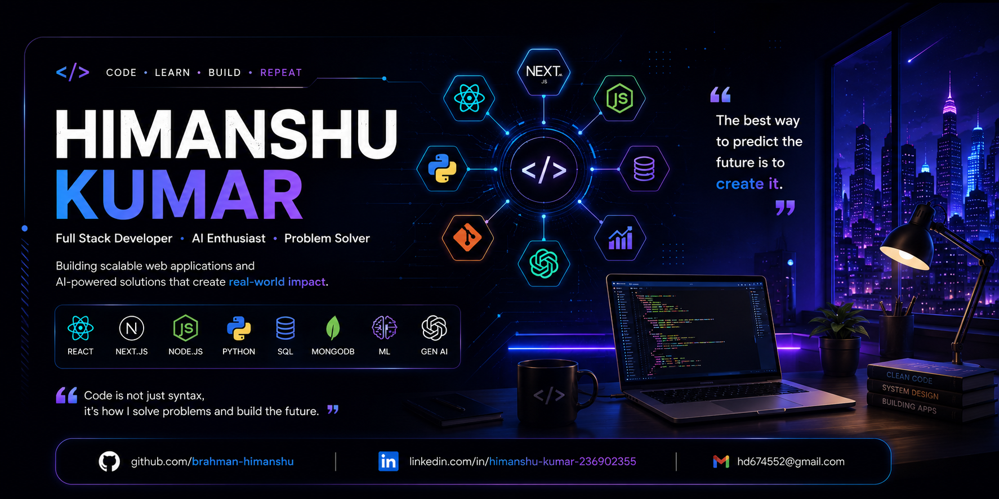

<div align="center">



# 👋 Hi, I'm Himanshu Kumar

### 🚀 Full Stack Developer • AI Enthusiast • Data Analytics • Machine Learning

<p align="center">


</p>

<p align="center">

<a href="mailto:hd674552@gmail.com">

</a>

<a href="https://www.linkedin.com/in/himanshu-kumar-236902355">

</a>

<a href="https://github.com/brahman-himanshu">

</a>

</p>

<p align="center">


</p>

</div>

---

# 💫 About Me

```cpp
class HimanshuKumar {

public:

    string role = "Full Stack Developer";

    vector<string> interests = {
        "Web Development",
        "Data Analytics",
        "Machine Learning",
        "Generative AI",
        "Open Source"
    };

    vector<string> currentlyLearning = {
        "DSA",
        "Next.js",
        "Machine Learning",
        "GenAI",
        "LLMs"
    };

    string goal = "Become a Full Stack + AI Engineer";

};
```

---

# 🚀 Current Focus

- 🌐 Building **Modern Full Stack Web Applications**
- 🧠 Learning **DSA for Placements**
- 📊 Exploring **Data Analytics using Python, SQL & Power BI**
- 🤖 Building **Machine Learning & Generative AI Projects**
- 🚀 Preparing for **Software Engineer & AI Internship Roles**
- 💙 Looking to Contribute to **Open Source Projects**

---

# 🛠 Skills & Expertise

## 💻 Programming Languages

<p>


</p>

---

## 🎨 Frontend

<p>


</p>

---

## ⚙ Backend

<p>


</p>

---

## 🗄 Database

<p>


</p>

---

## 🤖 AI • Machine Learning • Data Analytics

<p>


</p>

| Technology | Level |
|------------|--------|
| Pandas | ⭐⭐⭐⭐☆ |
| NumPy | ⭐⭐⭐⭐☆ |
| Scikit-Learn | ⭐⭐⭐⭐☆ |
| Power BI | ⭐⭐⭐⭐☆ |
| SQL | ⭐⭐⭐⭐☆ |
| Machine Learning | ⭐⭐⭐☆☆ |
| Generative AI | ⭐⭐⭐☆☆ |

---

## ☁ Deployment & Cloud

<p>


</p>

---

## 🧰 Developer Tools

<p>


</p>

---

# 🚀 Featured Projects

<table>
<tr>
<td width="50%">

### 🤖 AI Internship Simulator

AI-powered internship experience platform with interview simulation and evaluation.

**Tech Stack**

`React` `FastAPI` `Python` `Gemini AI`

🔗 **GitHub:** *(Add your repository link)*

🌐 **Live Demo:** *(Add deployed link)*

</td>

<td width="50%">

### 🏠 Ustad Ji

A modern home service booking platform with worker and customer portals.

**Tech Stack**

`Next.js` `FastAPI` `MongoDB`

🔗 **GitHub:** *(Add your repository link)*

🌐 **Live Demo:** *(Add deployed link)*

</td>

</tr>

<tr>

<td>

### 🌍 AI Delhi NCR Pollution Dashboard

AI-powered dashboard for pollution analysis and visualization.

**Tech Stack**

`Python` `Pandas` `Power BI` `Machine Learning`

🔗 **GitHub:** *(Add your repository link)*

🌐 **Live Demo:** *(Add deployed link)*

</td>

<td>

### 🌐 Personal Portfolio

Responsive portfolio showcasing projects, skills and experience.

**Tech Stack**

`React` `GSAP` `Three.js`

🔗 **GitHub:** *(Add your repository link)*

🌐 **Live Demo:** *(Add deployed link)*

</td>

</tr>

</table>

---

# 🏆 Achievements

- 🌟 Building Full Stack & AI Projects
- 💻 Consistently solving DSA problems
- 🚀 Exploring Machine Learning & Generative AI
- 🌍 Learning Data Analytics with Python & SQL
- 🤝 Contributing to Open Source

---

# 📚 Learning Journey

```text
✅ HTML & CSS
      │
      ▼
✅ JavaScript
      │
      ▼
✅ React.js
      │
      ▼
✅ Next.js
      │
      ▼
✅ Node.js & FastAPI
      │
      ▼
✅ SQL & MongoDB
      │
      ▼
✅ Data Structures & Algorithms
      │
      ▼
🚀 Data Analytics
      │
      ▼
🤖 Machine Learning
      │
      ▼
🧠 Generative AI
```

---

# 🎯 2026 Goals

- ✅ Master DSA
- ✅ Become MERN + Next.js Expert
- ✅ Build AI-powered Applications
- ✅ Learn Advanced Machine Learning
- ✅ Contribute to Open Source
- ✅ Secure a Software Engineer / AI Internship
- ✅ Build impactful real-world projects

---

# 📜 Certifications & Learning

### Currently Pursuing

- 📘 Full Stack Web Development
- 📗 Data Analytics
- 📙 Machine Learning
- 📕 Generative AI
- 📓 Data Structures & Algorithms

---

# 🌟 Open Source

I enjoy learning in public and contributing to projects that create real-world impact.

I'm always open to collaborating on:

- 🌐 Full Stack Applications
- 🤖 AI & Machine Learning
- 📊 Data Analytics
- 🚀 Open Source Projects

---

# 💼 Developer Philosophy

> **"Every project teaches something new. Every bug makes you a better developer. Consistency beats talent when talent doesn't stay consistent."**

---

# 💡 Quote


> **"Code. Learn. Build. Repeat. Success is a by-product of consistency."**

---

# 📊 GitHub Analytics

<div align="center">


</div>

<div align="center">


</div>

---

# 📈 GitHub Contribution Graph

<p align="center">


</p>

---

# 🐍 Contribution Snake

<p align="center">


</p>

> **Note:** Enable the `snake.yml` GitHub Action workflow to generate this animation automatically.

---

# 💻 Coding Profiles

<div align="center">

<a href="https://leetcode.com/">

</a>

<a href="https://www.geeksforgeeks.org/">

</a>

<a href="https://www.hackerrank.com/">

</a>

<a href="https://www.codechef.com/">

</a>

</div>

---

# 📚 Currently Exploring

<table>

<tr>

<td>🤖 Generative AI</td>
<td>██████████░░ 80%</td>

</tr>

<tr>

<td>🧠 Machine Learning</td>
<td>████████░░░░ 70%</td>

</tr>

<tr>

<td>📊 Data Analytics</td>
<td>█████████░░ 85%</td>

</tr>

<tr>

<td>🌐 Full Stack Development</td>
<td>███████████ 95%</td>

</tr>

<tr>

<td>⚡ DSA</td>
<td>████████░░░ 75%</td>

</tr>

</table>

---

# 🌍 Connect With Me

<div align="center">

<a href="mailto:hd674552@gmail.com">


</a>

<a href="https://www.linkedin.com/in/himanshu-kumar-236902355">


</a>

<a href="https://github.com/brahman-himanshu">


</a>

</div>

---

# ☕ Support My Work

<p align="center">

⭐ If you like my projects, consider giving them a **Star** on GitHub.

🤝 I'm always open to collaborating on **Full Stack**, **AI**, **Machine Learning**, and **Data Analytics** projects.

</p>

---

<div align="center">

## 🚀 "Dream Big • Build Bigger • Never Stop Learning"


</div>

---

# 💎 Developer Dashboard

<div align="center">

| 🚀 Focus | 📍 Status |
|----------|-----------|
| 🌐 Full Stack Development | 🟢 Active |
| 📊 Data Analytics | 🟢 Learning |
| 🤖 Machine Learning | 🟢 Learning |
| 🧠 Generative AI | 🟢 Exploring |
| ⚡ DSA | 🟢 Daily Practice |
| 🌍 Open Source | 🟢 Ready to Contribute |

</div>

---

# 🏅 Coding Platforms

<div align="center">

<a href="https://leetcode.com/your_username">

</a>

<a href="https://www.geeksforgeeks.org/user/your_username">

</a>

<a href="https://www.hackerrank.com/your_username">

</a>

<a href="https://www.codechef.com/users/your_username">

</a>

</div>

> Replace **your_username** with your actual profile usernames.

---

# 📅 2026 Learning Roadmap

```text
✅ HTML & CSS
        │
        ▼
✅ JavaScript
        │
        ▼
✅ React.js
        │
        ▼
✅ Next.js
        │
        ▼
✅ Node.js & FastAPI
        │
        ▼
✅ SQL & MongoDB
        │
        ▼
✅ DSA
        │
        ▼
🚀 Data Analytics
        │
        ▼
🤖 Machine Learning
        │
        ▼
🧠 Generative AI
        │
        ▼
☁ Cloud Computing
        │
        ▼
🤖 AI Agents & LLMs
```

---

# 📈 Weekly Development Goals

- ✅ Solve 5–7 DSA problems
- ✅ Build 1 Full Stack feature
- ✅ Learn 1 ML concept
- ✅ Complete 1 Data Analytics task
- ✅ Push code to GitHub every week
- ✅ Contribute to Open Source

---

# 🌟 Fun Facts

- 💻 I enjoy turning ideas into real-world applications.
- 🧩 I love solving programming challenges.
- 🚀 I believe consistency beats intensity.
- 📚 Every project teaches something new.

---

# 🎯 Career Objective

```text
Seeking opportunities to contribute as a

• Full Stack Developer
• Software Engineer
• AI / ML Engineer
• Data Analyst

while continuously learning and building impactful solutions.
```

---

# 📬 Let's Connect

<div align="center">

📧 **Email:** hd674552@gmail.com

💼 **LinkedIn:**  
https://www.linkedin.com/in/himanshu-kumar-236902355

🐙 **GitHub:**  
https://github.com/brahman-himanshu

</div>

---

# ❤️ Thanks for Visiting

<div align="center">

### ⭐ If you like my work, consider giving a ⭐ to my repositories.

### 🚀 *Code • Learn • Build • Repeat*


</div>
