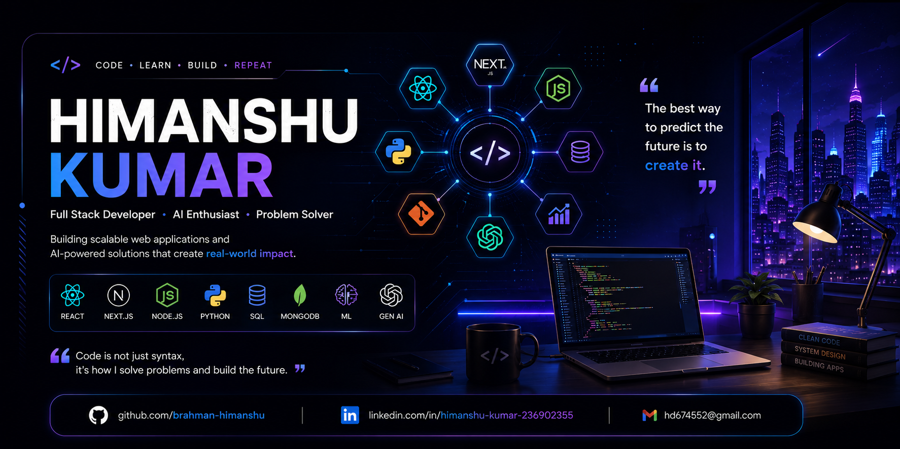

  

# 👋 Hi, I'm Himanshu Kumar

### 🚀 Full Stack Developer • AI Enthusiast • Data Analytics • Machine Learning

---

## 👨‍💻 About Me

<table>
<tr>
<td width="65%">

### Hi, I'm Himanshu 👋

💻 Full Stack Developer

📊 Data Analytics Learner

🤖 Machine Learning Explorer

🧠 DSA Problem Solver

🚀 Generative AI Enthusiast

🎯 Goal:
Become a Software Engineer capable of building scalable products using AI.

🌱 Currently Learning

- Advanced DSA
- React & Next.js
- Machine Learning
- Data Analytics
- GenAI
- LLMs

⚡ Fun Fact

I enjoy building projects more than watching tutorials.

</td>

<td width="35%">

</td>
</tr>
</table>

# 🛠 Skills & Expertise

## 💻 Programming Languages

---

## 🎨 Frontend

---

## ⚙ Backend

---

## 🗄 Database

---

## 🤖 AI • Machine Learning • Data Analytics

## ☁ Deployment & Cloud

---

## 🧰 Developer Tools

---

# 🚀 Featured Projects

<table>
<tr>
<td width="50%">

### 🤖 AI Internship Simulator

AI-powered internship experience platform with interview simulation and evaluation.

**Tech Stack**

`React` `FastAPI` `Python` `Gemini AI`

🔗 **GitHub:** *(Add your repository link)*

🌐 **Live Demo:** *(Add deployed link)*

</td>

<td width="50%">

### 🏠 Ustad Ji

A modern home service booking platform with worker and customer portals.

**Tech Stack**

`Next.js` `FastAPI` `MongoDB`

🔗 **GitHub:** *(Add your repository link)*

🌐 **Live Demo:** *(Add deployed link)*

</td>

</tr>

<tr>

<td>

### 🌍 AI Delhi NCR Pollution Dashboard

AI-powered dashboard for pollution analysis and visualization.

**Tech Stack**

`Python` `Pandas` `Power BI` `Machine Learning`

🔗 **GitHub:** *(Add your repository link)*

🌐 **Live Demo:** *(Add deployed link)*

</td>

<td>

### 🌐 Personal Portfolio

Responsive portfolio showcasing projects, skills and experience.

**Tech Stack**

`React` `GSAP` `Three.js`

🔗 **GitHub:** *(Add your repository link)*

🌐 **Live Demo:** *(Add deployed link)*

</td>

</tr>

</table>

---
# 📊 GitHub Analytics

---

# 📈 GitHub Contribution Graph

---
<h2 align="center">🐍 Contribution Snake</h2>

  

# 🌐 Let's Connect

### 📫 Feel free to connect with me

💼 **LinkedIn:**  
https://www.linkedin.com/in/himanshu-kumar-236902355

📧 **Email:**  
**hd674552@gmail.com**

🐙 **GitHub:**  
https://github.com/brahman-himanshu

💬 I'm always open to discussing:
- 🌐 Full Stack Development
- 🤖 Artificial Intelligence & Machine Learning
- 📊 Data Analytics
- 💡 Open Source Collaboration
- 🚀 Innovative Tech Projects

---

### ⭐ Thanks for visiting my profile!

**If you like my work, don't forget to ⭐ my repositories.**

